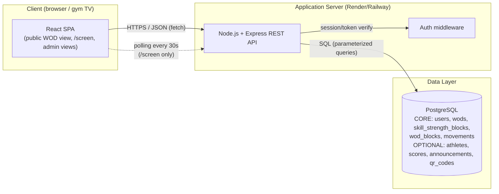
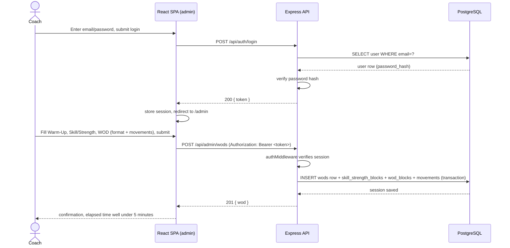
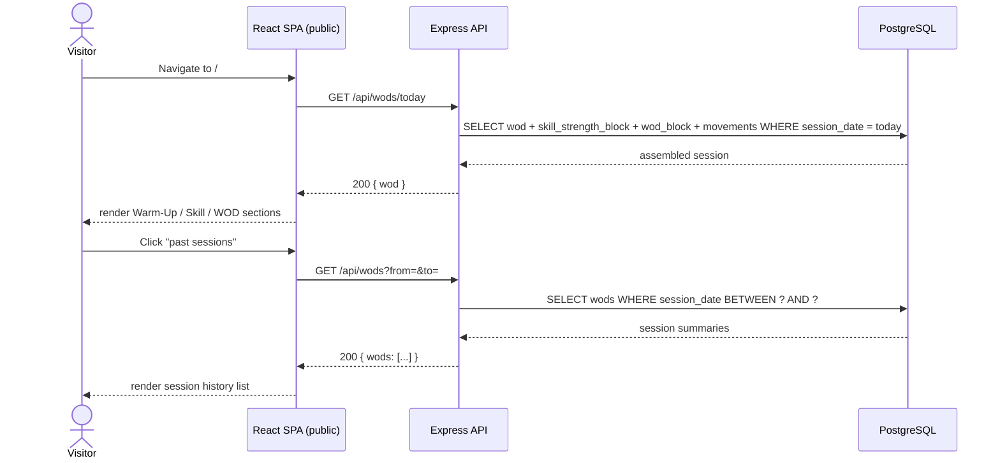
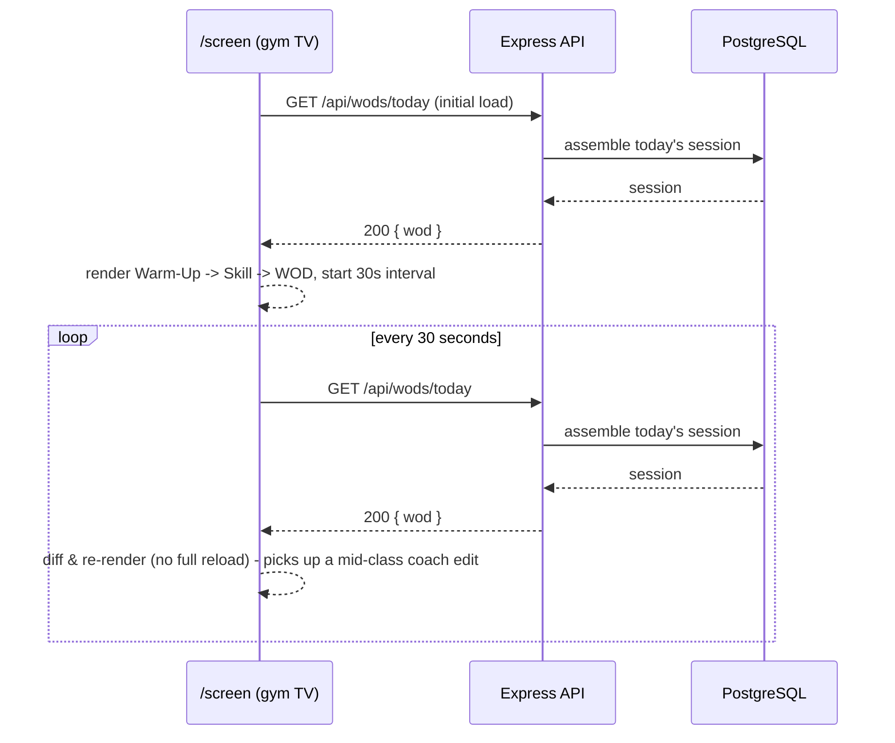
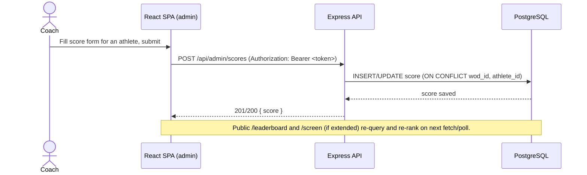

# BoxTrack - Technical Documentation

> DWWM end-of-year project (RNCP 37674) - Technical planning phase (Stage 3).
> This document translates the MVP decision from [01-idea-development.md](01-idea-development.md),
> refined against the official **cahier des charges v1.0** (signed off by Timothé Garde), into a
> detailed technical blueprint: user stories, architecture, data design, sequence diagrams, API
> specifications, and SCM/QA strategy for **BoxTrack**.
>
> **Reading key used throughout this document:** `CORE` = must ship (cahier des charges V1),
> `OPTIONAL` = built only once every `CORE` feature is done and demoed end-to-end.

---

## 0. User Stories and Mockups

### 0.1 User Stories (MoSCoW)

Roles: **Coach** (Timothé Garde / owner, authenticated admin), **Visitor** (public, no account,
includes athletes and the gym's TV).

#### Must Have (`CORE`)

| # | User Story | RNCP block(s) |
|---|---|---|
| M1 | As a **Coach**, I want to log in securely with email + password, so that only I can manage sessions. | C6 |
| M2 | As a **Coach**, I want to create/edit/delete a full session - Warm-Up (general + specific), Skill/Strength (skill or strength, movements, charges/series, instructions), and the WOD itself (format, movements/reps, duration or objective, remarks) - in under 5 minutes without training, so that I can publish it before class starts. | C4/C5 |
| M3 | As a **Coach**, I want the WOD's format to be one of AMRAP, For Time, EMOM, Tabata, Chipper, or Strength, so that the app speaks the CrossFit vocabulary my coaches already use. | C4/C5 |
| M4 | As a **Visitor**, I want to see today's session without logging in, with each phase (Warm-Up / Skill / WOD) shown distinctly and the format highlighted, so that I know what to expect before class. | C2/C3 |
| M5 | As a **Visitor**, I want to navigate to past sessions, so that I can check what was programmed on a previous day. | C3/C4 |
| M6 | As a **Visitor** (the gym's TV), I want a dedicated `/screen` view that projects the current session (Warm-Up -> Skill -> WOD) fullscreen, readable from 5-8m, with no interaction and no scroll, so that the box can run it unattended on the TV/projector every class. | C1/C2/C3 |
| M7 | As a **Coach**, I want all admin routes protected so unauthenticated users get rejected, with a persistent session and an explicit logout, so that only I can modify data. | C6 |

#### Should Have

| # | User Story | RNCP block(s) |
|---|---|---|
| S1 | As a **Coach**, I want a lightweight dashboard showing today's session and a quick "new session" action, so that publishing stays under the 5-minute non-negotiable target even on a busy morning. | C2/C3 |

#### Could Have (`OPTIONAL` - only after all Must Have items are done and demoed)

| # | User Story | RNCP block(s) |
|---|---|---|
| C1' | As a **Coach**, I want to record each athlete's score for the day's WOD (RX/Scaled/Modified), so that results are tracked per category. | C4/C5 |
| C2' | As a **Coach**, I want to edit or correct a score after entry, so that I can fix mistakes made during a busy class. | C4/C5 |
| C3' | As a **Visitor**, I want to see an automatically ranked leaderboard for the current WOD, optionally filtered by category, so that I know how I compare to other athletes. | C3/C4 |
| C4' | As a **Coach**, I want to add, edit, or deactivate athletes, so that the roster reflects who currently trains at the box. | C4/C5 |
| C5' | As the **Owner**, I want to publish announcements (events, closures, planning changes, promotions) visible publicly and TV-ready, so that box communication isn't scattered across social media. | C4/C5 |
| C6' | As the **Owner**, I want a screen displaying labeled, configurable QR codes (Google reviews, Instagram, sign-up, WhatsApp group, referral), so that members can scan the box's key links directly off the TV or a tablet at the front desk. | C4/C5 |

#### Won't Have (this MVP)

| # | User Story | Reason |
|---|---|---|
| W1 | As an **Athlete**, I want my own login to see my personal history. | Explicitly out-of-scope (see [01-idea-development.md §3.7](01-idea-development.md)) - the cahier des charges states athletes never self-register in V1. |
| W2 | As a **Visitor**, I want to book a class or pay for membership. | Out-of-scope: no booking/payment system planned. |
| W3 | As a **Coach**, I want progress charts and PR-tracking analytics. | Out-of-scope: advanced analytics excluded from MVP. |

### 0.2 Mockups

Per the cahier des charges (deliverable "Maquettes de toutes les vues"), high-fidelity mockups are
required for **all five** view types below - including the two `OPTIONAL` screens, whose designs
must exist even if their build only happens if time permits. Mobile + desktop are covered for every
public-facing view; `/screen` is designed in 16:9 only. Exports are stored under `docs/mockups/`
(ownership: front-end-focused member, reviewed jointly, then validated by Timothé Garde per the
cahier des charges' collaboration rules).

| Screen | Tier | Purpose | Key layout notes |
|---|---|---|---|
| **Public - Session of the day** (`/`) | `CORE` | Visitor lands here by default | Mobile-first single column: Warm-Up card, Skill/Strength card, WOD card (format badge prominent), link to past sessions. Desktop: same content, wider grid. |
| **Admin - Session form** (`/admin/wods/new`) | `CORE` | Coach publishes a session in <5 min | Three-step (or single scrollable) form mirroring the domain: Warm-Up (2 free-text fields) -> Skill/Strength (kind toggle + movement rows) -> WOD (format select + movement rows + duration/objective). Movement rows are simple repeatable "name + detail" inputs, add/remove inline - no page navigation. |
| **Broadcast `/screen`** | `CORE` | Gym TV, 16:9, viewed from 5-8m | Full-viewport, no scroll, large `clamp()`-scaled type, structured Warm-Up -> Skill -> WOD sections, WCAG AAA contrast (dark background, high-contrast text), auto-refreshes every 30s in case the coach edits the session mid-class. |
| **Public - Announcements** | `OPTIONAL` | Box news/events, shareable/TV-ready | Card list, most recent first; simple enough to also work as a `/screen`-style single-announcement rotation if time allows. |
| **Public - QR Codes** | `OPTIONAL` | Community links, shareable/TV-ready | Grid of labeled QR codes with an icon per use case (Google review, Instagram, sign-up, WhatsApp, referral), legible from 3-5m per the cahier des charges. |

> Mockups are wireframe-level first (Balsamiq-style boxes and labels) to validate layout and
> information hierarchy, then refined to high-fidelity once the Direction Artistique (palette,
> typography, logo usage) is validated by the sponsor - both are required deliverables before
> development starts on that screen.

---

## 1. System Architecture

BoxTrack is a classic three-tier web application: a React single-page front-end, a Node.js/Express
REST API, and a PostgreSQL relational database, deployed as two services behind HTTPS.



**Data flow summary:**

1. The browser (or gym TV) loads the React SPA as static assets from a CDN/static host.
2. The SPA calls the Express REST API over HTTPS using `fetch`, sending the coach's credentials
   (session token) in the `Authorization` header for admin routes.
3. Express validates/authenticates the request, runs parameterized SQL against PostgreSQL, and
   returns JSON.
4. The `/screen` route polls `GET /api/wods/today` on a fixed 30-second interval so an in-class edit
   by the coach shows up without a manual reload; every other public view fetches once on
   load/navigation.

**Why this architecture:**

- **Three-tier, not monolith-rendered:** a SPA decoupled from a JSON API lets `/screen` poll a
  lightweight endpoint independently from full page loads, and keeps front-end/back-end ownership
  split cleanly between the two team members (see [01-idea-development.md §1](01-idea-development.md)).
- **Relational database (PostgreSQL) over NoSQL:** even the `CORE` tier alone has real relational
  structure - one session has one Warm-Up, one Skill/Strength block, one WOD block, and an ordered
  list of movements per phase - which maps directly to foreign keys and simple joins rather than
  denormalized documents. The `OPTIONAL` tier adds further relational constraints (`UNIQUE(wod_id,
  athlete_id)` on scores) if/when it gets built.
- **No external API dependency for the MVP core:** session, and later score/leaderboard, data is
  entirely first-party, keeping the system fully functional without third-party uptime risk (see
  [Section 4](#4-document-external-and-internal-apis)).
- **Polling over WebSockets:** a fixed-interval `fetch` is the simpler, lower-risk choice for
  `/screen`'s "no manual reload" requirement given the team's timeline and experience level
  ([01-idea-development.md §3.8](01-idea-development.md) risk table); WebSockets/SSE are a possible
  post-MVP upgrade.

---

## 2. Components, Classes, and Database Design

### 2.1 Back-end structure (Express, layered)

```
src/
├── routes/        # HTTP routing only (maps path+method to controller)
├── controllers/    # Request/response handling, input validation
├── services/       # Business logic (session assembly, ranking computation - optional tier)
├── models/         # Data access layer (SQL queries per entity)
├── middleware/      # auth verification, error handler, request logging
└── config/          # DB connection, env config
```

| Component | Tier | Responsibility |
|---|---|---|
| `AuthController` / `authService` | `CORE` | Login (verify hashed password, issue session token). |
| `WodController` / `wodService` / `WodModel` | `CORE` | CRUD for a full session: `wods` row + its `skill_strength_blocks`, `wod_blocks`, and ordered `movements` rows, assembled/disassembled as one nested JSON object per request. Enforces "one session per date". |
| `authMiddleware` | `CORE` | Verifies the coach's session on all `/api/admin/*` routes, attaches `req.user`, rejects with 401/403 otherwise. |
| `ScoreController` / `scoreService` / `ScoreModel` | `OPTIONAL` | Create/update a score; enforces `UNIQUE(wod_id, athlete_id)`; triggers ranking recompute. |
| `LeaderboardService` | `OPTIONAL` | Computes ranking for a given WOD (server-side, one indexed SQL query, grouped by category). |
| `AthleteController` / `athleteService` / `AthleteModel` | `OPTIONAL` | CRUD for athletes; deactivate instead of hard delete (preserve score history). |
| `AnnouncementController` / `announcementService` | `OPTIONAL` | CRUD for box announcements. |
| `QrCodeController` / `qrCodeService` | `OPTIONAL` | CRUD for labeled QR code entries. |

### 2.2 Front-end structure (React)

| Component | Tier | Responsibility |
|---|---|---|
| `<PublicLayout>` | `CORE` | Shell for public routes (session of the day, history). |
| `<SessionView>` | `CORE` | Renders a full session as three distinct phase sections (Warm-Up / Skill-Strength / WOD), format badge highlighted. Reused by both the public route and (in a broadcast-styled variant) `/screen`. |
| `<ScreenView>` | `CORE` | Full-viewport broadcast layout wrapping `<SessionView variant="broadcast">`, polling every 30s; owns the `clamp()`-based responsive typography and strict 16:9/no-scroll rules. |
| `<AdminLayout>` | `CORE` | Shell for authenticated routes; reads the session token, redirects to `/login` if absent/expired. |
| `<SessionForm>` | `CORE` | Multi-section controlled form (Warm-Up, Skill/Strength with repeatable movement rows, WOD with format select + repeatable movement rows), client-side validation mirroring the API, designed for the <5-minute non-negotiable UX target. |
| `<AdminDashboard>` | Should Have | Today's session summary + "new session" quick action. |
| `<Leaderboard>` | `OPTIONAL` | Fetches and renders ranked scores; accepts a `pollIntervalMs` prop. |
| `<ScoreForm>`, `<AthleteForm>` | `OPTIONAL` | Controlled CRUD forms for the Optional tier. |
| `<AnnouncementsView>`, `<QrCodesView>` | `OPTIONAL` | Public + TV-ready displays for the two extra box-life screens. |
| `useAuth()` (hook) | `CORE` | Wraps login/logout, exposes the current session/role. |
| `useFetch()` / `useApi()` (hook) | `CORE` | Thin wrapper over `fetch` that injects the `Authorization` header and handles 401 → redirect-to-login. |

### 2.3 Database Design (PostgreSQL - relational)

```mermaid
erDiagram
    USERS ||--o{ WODS : creates
    WODS ||--o| SKILL_STRENGTH_BLOCKS : has
    WODS ||--o| WOD_BLOCKS : has
    WODS ||--o{ MOVEMENTS : has
    WODS ||--o{ SCORES : "has (optional)"
    ATHLETES ||--o{ SCORES : "achieves (optional)"
    USERS ||--o{ ANNOUNCEMENTS : "publishes (optional)"
    USERS ||--o{ QR_CODES : "configures (optional)"

    USERS {
        int id PK
        string email UK
        string password_hash
        string role "coach"
        timestamp created_at
    }
    WODS {
        int id PK
        date session_date UK "one session per date"
        string time_slot
        text warmup_general
        text warmup_specific
        int created_by FK
        timestamp created_at
        timestamp updated_at
    }
    SKILL_STRENGTH_BLOCKS {
        int id PK
        int wod_id FK UK
        string kind "skill | strength"
        text instructions
    }
    WOD_BLOCKS {
        int id PK
        int wod_id FK UK
        string format "AMRAP | FOR_TIME | EMOM | TABATA | CHIPPER | STRENGTH"
        string duration_or_target "e.g. 20 min, 5 rounds"
        text notes
    }
    MOVEMENTS {
        int id PK
        int wod_id FK
        string phase "skill_strength | wod"
        string movement_name
        string detail "e.g. 5x5 @ 80kg, 15 reps"
        int order_index
    }
    ATHLETES {
        int id PK
        string first_name
        string last_name
        string photo_url "nullable"
        boolean active
        timestamp created_at
    }
    SCORES {
        int id PK
        int wod_id FK
        int athlete_id FK
        string category "RX | Scaled | Modified"
        string result_raw "display value, e.g. 12:34 or 90kg"
        int result_seconds "nullable - For Time, Chipper"
        int result_reps "nullable - Tabata, AMRAP extra reps"
        int result_rounds "nullable - AMRAP, EMOM"
        numeric result_kg "nullable - Strength"
        int recorded_by FK
        timestamp created_at
        timestamp updated_at
    }
    ANNOUNCEMENTS {
        int id PK
        string title
        text body
        timestamp starts_at "nullable"
        timestamp ends_at "nullable"
        int created_by FK
        timestamp created_at
        timestamp updated_at
    }
    QR_CODES {
        int id PK
        string label
        string destination_url
        string icon "nullable"
        int order_index
        int created_by FK
        timestamp created_at
    }
```

**Key design choices:**

- **One generic `MOVEMENTS` table for both Skill/Strength and WOD movements** (discriminated by the
  `phase` column) instead of two near-identical tables - both phases just need an ordered list of
  "movement name + detail" (charges/series for Skill/Strength; reps/load for the WOD), so a single
  table avoids duplicated structure while staying trivial to query (`WHERE wod_id = ? AND phase = ?
  ORDER BY order_index`).
- **`WODS.warmup_general`/`warmup_specific` are plain columns, not a separate table** - the cahier
  des charges describes Warm-Up as two free-text fields with a strict 1:1 relationship to the
  session, so a join would add no value.
- **`SKILL_STRENGTH_BLOCKS`/`WOD_BLOCKS` are separate 1:1 tables, not columns on `WODS`** - each has
  its own distinct shape (`kind` vs. `format`) and its own movement list, and keeping them separate
  mirrors the domain's three-phase structure directly, which matters for a schema the coach's own
  team (and the jury) needs to read and trust as an accurate model of a real CrossFit session.
- **`SCORES` keeps 4 nullable normalized result columns instead of one generic number** - because the
  6 WOD formats score fundamentally different things (a time, a rep count, a round count, or a
  load), a single "score" leaderboard/ranking query needs to know exactly which column to sort by
  per format; `result_raw` remains the human-readable display value shown everywhere else.
- **`WODS.UNIQUE(session_date)`** - enforces "one session per date" at the database level, not just
  in application logic (`CORE`, non-negotiable per the cahier des charges).
- **`SCORES.UNIQUE(wod_id, athlete_id)`** (`OPTIONAL`) - one score per athlete per WOD; edits update
  the existing row rather than inserting a duplicate.
- **`ATHLETES.active`** (`OPTIONAL`) is a soft-delete flag: deactivating an athlete hides them from
  new-score forms without deleting their historical scores.

**Why PostgreSQL over a document store:** the domain is inherently relational from the `CORE` tier
alone (a session's phases and ordered movement lists are foreign-keyed rows, not a denormalized
blob), and the `OPTIONAL` tier adds a composite uniqueness constraint plus a ranking query that
benefits from SQL `ORDER BY`/`RANK()` over an index - this was explicitly the deciding factor for
RNCP block C4/C5 depth in the MVP selection ([01-idea-development.md §2.4](01-idea-development.md)).

---

## 3. High-Level Sequence Diagrams

### 3.1 Coach logs in and publishes a full session (`CORE`)



### 3.2 Visitor views the public session and browses history (`CORE`)



### 3.3 Broadcast `/screen` auto-polling (`CORE`)



### 3.4 Optional: coach records a score, leaderboard re-ranks (`OPTIONAL`)



---

## 4. Document External and Internal APIs

### 4.1 External APIs

BoxTrack's MVP core requires **no external API** - session, and later score/leaderboard, data is
entirely first-party, which avoids third-party downtime affecting the gym's live TV display (a
deliberate choice, see [Section 1](#1-system-architecture)).

| External service | Purpose | Status |
|---|---|---|
| None required for MVP core | — | — |
| *(Optional, post-MVP)* Transactional email provider (e.g. Resend, SendGrid) | Password-reset email for the coach account | Out of MVP scope; coach password reset handled manually/DB-side for a single-admin MVP. |

### 4.2 Internal API - Endpoints

Base URL: `/api`. All admin routes require `Authorization: Bearer <token>` and are protected by
`authMiddleware` (401 if missing/invalid, 403 if role check fails).

#### Auth (`CORE`)

| Method | Path | Auth | Input | Output |
|---|---|---|---|---|
| POST | `/api/auth/login` | Public | `{ email, password }` | `200 { token, user: { id, email } }` / `401 { error }` |
| POST | `/api/auth/logout` | Coach | — | `204` (invalidates the session) |

#### Sessions / WODs (`CORE`)

| Method | Path | Auth | Input | Output |
|---|---|---|---|---|
| GET | `/api/wods/today` | Public | — | `200 { wod }` (full nested session) / `404` if none published |
| GET | `/api/wods` | Public | Query: `?from=&to=` (optional date range) | `200 { wods: [...] }` (summaries, for history nav) |
| GET | `/api/wods/:id` | Public | — | `200 { wod }` (full nested session) / `404` |
| POST | `/api/admin/wods` | Coach | `{ session_date, time_slot, warmup: { general, specific }, skill_strength: { kind, instructions, movements: [{ movement_name, detail }] }, wod: { format, duration_or_target, notes, movements: [{ movement_name, detail }] } }` | `201 { wod }` / `409` if the date already has a session |
| PUT | `/api/admin/wods/:id` | Coach | Same shape, any subset of fields | `200 { wod }` / `404` |
| DELETE | `/api/admin/wods/:id` | Coach | — | `204` / `404` |

#### Scores & Leaderboard (`OPTIONAL`)

| Method | Path | Auth | Input | Output |
|---|---|---|---|---|
| POST | `/api/admin/scores` | Coach | `{ wod_id, athlete_id, category, result_raw }` | `201 { score }` (upserts on `UNIQUE(wod_id, athlete_id)`) |
| PUT | `/api/admin/scores/:id` | Coach | `{ category?, result_raw? }` | `200 { score }` / `404` |
| GET | `/api/wods/:id/leaderboard` | Public | Query: `?category=RX\|Scaled\|Modified` (optional) | `200 { wod, rankings: [{ rank, athlete, category, result_raw }] }` |
| GET | `/api/wods/today/leaderboard` | Public | Same as above | Same shape |

#### Athletes (`OPTIONAL`)

| Method | Path | Auth | Input | Output |
|---|---|---|---|---|
| GET | `/api/admin/athletes` | Coach | Query: `?active=true\|false` | `200 { athletes: [...] }` |
| POST | `/api/admin/athletes` | Coach | `{ first_name, last_name, photo_url? }` | `201 { athlete }` |
| PUT | `/api/admin/athletes/:id` | Coach | `{ first_name?, last_name?, photo_url?, active? }` | `200 { athlete }` / `404` |

#### Announcements & QR Codes (`OPTIONAL`)

| Method | Path | Auth | Input | Output |
|---|---|---|---|---|
| GET | `/api/announcements` | Public | — | `200 { announcements: [...] }` |
| POST/PUT/DELETE | `/api/admin/announcements[/:id]` | Coach | `{ title, body, starts_at?, ends_at? }` | Standard CRUD responses |
| GET | `/api/qr-codes` | Public | — | `200 { qrCodes: [...] }` |
| POST/PUT/DELETE | `/api/admin/qr-codes[/:id]` | Coach | `{ label, destination_url, icon? }` | Standard CRUD responses |

**Error format (consistent across all endpoints):**

```json
{ "error": { "code": "VALIDATION_ERROR", "message": "session_date is required" } }
```

---

## 5. Plan SCM and QA Strategies

### 5.1 Source Control Management (SCM)

| Aspect | Strategy |
|---|---|
| **Tool** | Git + GitHub, as decided in team formation ([01-idea-development.md §1](01-idea-development.md)). |
| **Branching model** | `main` (always deployable) ← `develop` (integration) ← `feature/<short-description>` branches, one per user story/Notion card. |
| **Commits** | Conventional Commits style (`feat:`, `fix:`, `chore:`, `docs:`, `test:`), in English, one logical change per commit. |
| **Pull Requests** | Every feature branch opens a PR into `develop`; reviewed and approved by the other team member before merge (no self-merge). PR description links the Notion card. |
| **Code review checklist** | Naming/readability, no secrets committed, tests included for new endpoints/components, matches the API spec in Section 4, and - for any `OPTIONAL` feature PR - a check that all `CORE` items are already merged and demoed. |
| **Releases** | `develop` merged into `main` at the end of each sprint once QA passes; `main` merges trigger deployment (see 5.3). |
| **Environment secrets** | `.env` files git-ignored; `.env.example` committed with placeholder keys (`DATABASE_URL`, `SESSION_SECRET`). |

### 5.2 Quality Assurance (QA)

| Test type | Scope | Tooling |
|---|---|---|
| **Unit tests** | Services and models in isolation (e.g. session assembly/disassembly across `wods`/`skill_strength_blocks`/`wod_blocks`/`movements`, auth password-check helper, and - `OPTIONAL` - ranking computation, score upsert logic). | Jest |
| **Integration tests** | API endpoints against a real test database (e.g. login rejects wrong password, admin routes reject missing/invalid session with 401/403, `wods.session_date` `UNIQUE` constraint returns a clean error instead of a 500). | Jest + Supertest, seeded test PostgreSQL instance |
| **Manual/exploratory testing** | Critical `CORE` flow first: publish a full session (<5 min, no training) -> public display -> `/screen` projection on an actual TV/large display at 5-8m for contrast and layout; `OPTIONAL` flow (score entry -> leaderboard) tested only once `CORE` is signed off. | Manual, checklist per sprint |
| **API contract testing** | Verifying request/response shapes against Section 4 before front-end integration. | Postman collection, exported and versioned in `/docs/postman/` |
| **Accessibility check** | WCAG AAA contrast validation specifically for `/screen` (SMART goal 3, [01-idea-development.md §3.6](01-idea-development.md)). | Browser DevTools contrast checker / axe |

**Minimum bar before merging to `main`:** all unit + integration tests green in CI, at least 3
Postman tests confirming auth rejection on protected routes (per SMART goal 4), no linter errors
(ESLint + Prettier, shared config committed to the repo), zero known bug that blocks a `CORE` flow
(non-negotiable reliability requirement from the cahier des charges: no white screen, no 500 during
a class).

### 5.3 Deployment Pipeline

| Environment | Trigger | Host (proposed) |
|---|---|---|
| **Staging** | Push to `develop` | Render/Railway free tier, connected to a staging PostgreSQL instance, used for pre-release manual QA. |
| **Production** | Merge to `main` | Render/Railway, public HTTPS URL, production PostgreSQL instance with periodic backups. |

A minimal skeleton is deployed as early as Sprint 2 (per the Stage 1 risk mitigation plan,
[01-idea-development.md §3.8](01-idea-development.md)) so infrastructure/HTTPS/env issues surface
early rather than at the end of the timeline.

---

## 6. Technical Justifications Summary

| Decision | Justification |
|---|---|
| React SPA + Express REST API (decoupled) | Clean front-end/back-end ownership split for the two-person team; lets `/screen` poll a lightweight JSON endpoint independent of full page renders. |
| PostgreSQL (relational) | The domain is relational from the `CORE` tier alone (session -> phases -> ordered movements via foreign keys); the `OPTIONAL` tier adds `UNIQUE(wod_id, athlete_id)` and an indexed ranking query - directly satisfies RNCP blocks C4/C5 with genuine depth. |
| One generic `movements` table across Skill/Strength and WOD phases | Both phases need the same shape (ordered movement + detail); a single discriminated table avoids duplicated structure without losing per-phase queryability. |
| `CORE`/`OPTIONAL` split enforced in the backlog and PR checklist | Directly reflects the official cahier des charges' own prioritization ("si le temps le permet") rather than the team's earlier, broader assumption that scoring/leaderboard was Must Have. |
| Session-based authentication | Suits a small single-role (`coach`) admin surface without extra client-side token-refresh complexity; satisfies RNCP block C6 and SMART goal 4 on protected routes. |
| Polling (30s) over WebSockets for `/screen` | Lower implementation risk for a team new to real-time UI, per the Stage 1 risk table; a fixed-interval `fetch` is sufficient to pick up an in-class coach edit without sub-second latency. |
| No external API dependency in MVP core | Removes third-party outage risk from a system whose main demo moment is a live, always-on gym TV display. |
| Soft-delete (`active` flag) for athletes (`OPTIONAL`) | Preserves historical score integrity for past leaderboards/history views while still letting the coach manage an active roster. |
| Feature-branch + mandatory PR review Git workflow | Matches team working norms from Stage 1 and keeps both members aware of the full codebase despite shared full-stack ownership (RNCP requirement to demonstrate all blocks individually). |
