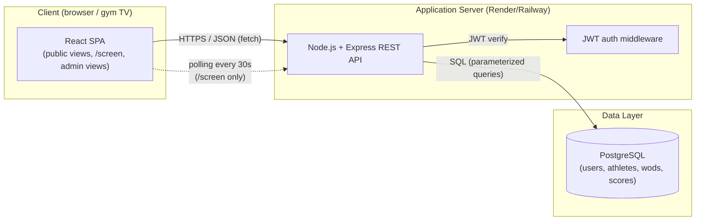
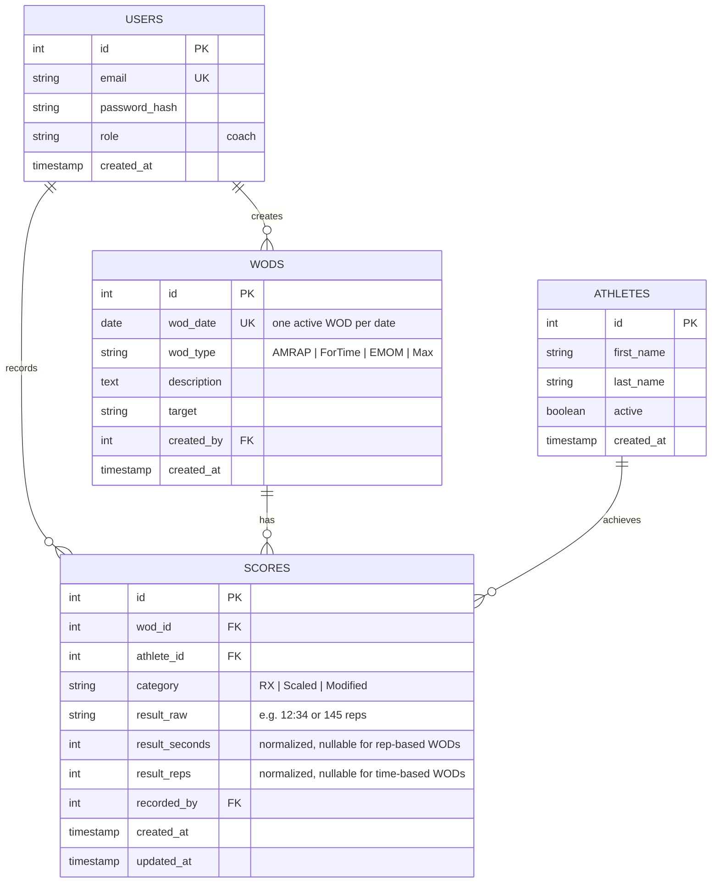
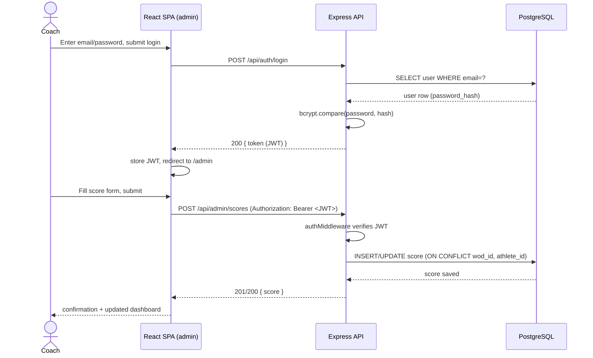
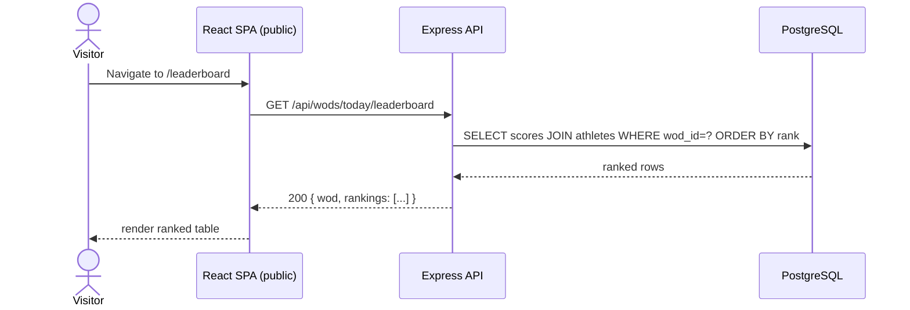
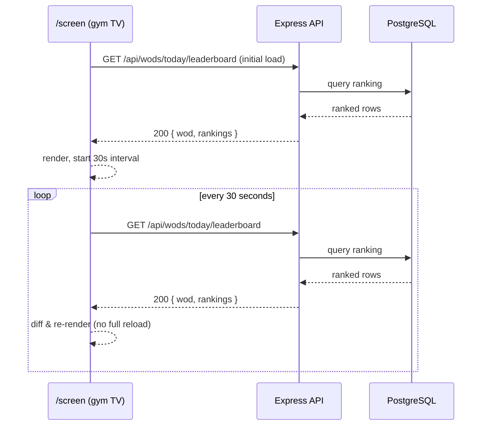

# BoxTrack - Technical Documentation

> DWWM end-of-year project (RNCP 37674) - Technical planning phase (Stage 3).
> This document translates the MVP decision from [01-idea-development.md](01-idea-development.md)
> into a detailed technical blueprint: user stories, architecture, data design, sequence
> diagrams, API specifications, and SCM/QA strategy for **BoxTrack**.

---

## 0. User Stories and Mockups

### 0.1 User Stories (MoSCoW)

Roles: **Coach** (Timothé Garde, authenticated admin), **Visitor** (public, no account, includes
athletes and the gym's TV).

#### Must Have

| # | User Story | RNCP block(s) |
|---|---|---|
| M1 | As a **Coach**, I want to log in securely, so that only I can manage WODs, scores, and athletes. | C6 |
| M2 | As a **Coach**, I want to create/edit/delete the WOD of the day (type, description, target), so that athletes always see the current workout. | C4/C5 |
| M3 | As a **Coach**, I want to record each athlete's score for the day's WOD, categorized RX/Scaled/Modified, so that results are tracked per category. | C4/C5 |
| M4 | As a **Coach**, I want to edit or correct a score after entry, so that I can fix mistakes made during a busy class. | C4/C5 |
| M5 | As a **Coach**, I want to add, edit, or deactivate athletes, so that the roster reflects who currently trains at the box. | C4/C5 |
| M6 | As a **Visitor**, I want to see today's WOD without logging in, so that I know what to expect before class. | C2/C3 |
| M7 | As a **Visitor**, I want to see an automatically ranked leaderboard for the current WOD, so that I know how I compare to other athletes. | C3/C4 |
| M8 | As a **Visitor** (the gym), I want a dedicated `/screen` view that auto-refreshes the leaderboard, so that the TV always shows live results with no manual reload. | C1/C2/C3 |
| M9 | As a **Coach**, I want all admin routes protected so unauthenticated users get rejected, so that only I can modify data. | C6 |

#### Should Have

| # | User Story | RNCP block(s) |
|---|---|---|
| S1 | As a **Coach**, I want a dashboard showing today's WOD, latest scores, and active athlete count, so that I get a quick daily overview. | C2/C3 |
| S2 | As a **Visitor**, I want to browse historical WODs and their leaderboards, so that I can see past results. | C3/C4 |
| S3 | As a **Coach**, I want the leaderboard to re-rank automatically on every score save, so that I never have to compute rankings manually. | C4/C5 |

#### Could Have

| # | User Story | RNCP block(s) |
|---|---|---|
| C1' | As a **Visitor**, I want to filter the leaderboard by category (RX/Scaled/Modified), so that I can compare against athletes at my level. | C3 |
| C2' | As a **Coach**, I want to search/filter athletes by name or status, so that I can manage a larger roster faster. | C2/C3 |

#### Won't Have (this MVP)

| # | User Story | Reason |
|---|---|---|
| W1 | As an **Athlete**, I want my own login to see my personal history. | Explicitly out-of-scope (see [01-idea-development.md §3.7](01-idea-development.md)) - stretch goal only. |
| W2 | As a **Visitor**, I want to book a class or pay for membership. | Out-of-scope: no booking/payment system planned. |
| W3 | As a **Coach**, I want progress charts and PR-tracking analytics. | Out-of-scope: advanced analytics excluded from MVP. |

### 0.2 Mockups

BoxTrack is a UI-heavy MVP (the `/screen` broadcast view is the project's central technical
challenge), so low-fidelity wireframes were produced in Figma for the four key screens. Static
exports are stored under `docs/mockups/` (ownership: front-end-focused member, reviewed jointly).

| Screen | Purpose | Key layout notes |
|---|---|---|
| **Public - WOD of the day** (`/`) | Visitor lands here by default | Mobile-first single column: WOD card on top, link to leaderboard below. |
| **Public - Leaderboard** (`/leaderboard`) | Ranked results for the current WOD | Sortable table, category filter (Should Have), rank badges for top 3. |
| **Broadcast `/screen`** | Gym TV, 16:9, viewed from 5-8m | Full-viewport, no scroll, large `clamp()`-scaled type, auto-polling every 30s, WCAG AAA contrast (dark background, high-contrast text). |
| **Coach dashboard** (`/admin`) | Authenticated landing page | Today's WOD summary, latest scores table, quick-action buttons (New WOD, New Score, New Athlete). |
| **Coach - WOD/Score forms** (`/admin/wods`, `/admin/scores`) | CRUD forms | Standard authenticated form layout with validation feedback. |

> Mockups are wireframe-level (Balsamiq-style boxes and labels), not high-fidelity visual design -
> sufficient to validate layout and information hierarchy before implementation, per project tips
> ("keep it clear and simple").

---

## 1. System Architecture

BoxTrack is a classic three-tier web application: a React single-page front-end, a Node.js/Express
REST API, and a PostgreSQL relational database, deployed as two services behind HTTPS.



**Data flow summary:**

1. The browser (or gym TV) loads the React SPA as static assets from a CDN/static host.
2. The SPA calls the Express REST API over HTTPS using `fetch`, sending a JWT in the
   `Authorization` header for admin routes.
3. Express validates/authenticates the request, runs parameterized SQL against PostgreSQL, and
   returns JSON.
4. The `/screen` route polls the leaderboard endpoint on a fixed 30-second interval; every other
   public view fetches once on load/navigation.

**Why this architecture:**

- **Three-tier, not monolith-rendered:** a SPA decoupled from a JSON API lets the `/screen` view
  poll a lightweight endpoint independently from full page loads, and keeps front-end/back-end
  ownership split cleanly between the two team members (see [01-idea-development.md §1](01-idea-development.md)).
- **Relational database (PostgreSQL) over NoSQL:** the domain has real relational constraints
  (one score per athlete per WOD, foreign keys between athletes/wods/scores) that map directly to
  SQL constraints and an indexed ranking query, which was a deciding factor in the MVP evaluation
  ([01-idea-development.md §2.5](01-idea-development.md)).
- **No external API dependency for the MVP core:** the leaderboard, WOD, and score logic use only
  first-party data, keeping the system fully functional without third-party uptime risk (see
  [Section 4](#4-document-external-and-internal-apis) for the one optional external service).
- **Polling over WebSockets:** a fixed-interval `fetch` is explicitly the simpler, lower-risk choice
  for real-time-ish updates given the team's timeline and experience level
  ([01-idea-development.md §3.8](01-idea-development.md) risk table); WebSockets/SSE are a possible
  post-MVP upgrade if latency becomes an issue.

---

## 2. Components, Classes, and Database Design

### 2.1 Back-end structure (Express, layered)

```
src/
├── routes/        # HTTP routing only (maps path+method to controller)
├── controllers/    # Request/response handling, input validation
├── services/       # Business logic (ranking computation, score rules)
├── models/         # Data access layer (SQL queries per entity)
├── middleware/      # auth (JWT verify), error handler, request logging
└── config/          # DB connection, env config
```

| Component | Responsibility |
|---|---|
| `AuthController` / `authService` | Login (verify bcrypt hash, issue JWT), token refresh not in MVP scope. |
| `WodController` / `wodService` / `WodModel` | CRUD for the daily WOD; enforces "one active WOD per date". |
| `AthleteController` / `athleteService` / `AthleteModel` | CRUD for athletes; deactivate instead of hard delete (preserve score history). |
| `ScoreController` / `scoreService` / `ScoreModel` | Create/update a score; enforces `UNIQUE(wod_id, athlete_id)`; triggers ranking recompute. |
| `LeaderboardService` | Computes ranking for a given WOD (server-side, one indexed SQL query, grouped by category). |
| `authMiddleware` | Verifies JWT on all `/api/admin/*` routes, attaches `req.user`, rejects with 401/403 otherwise. |

### 2.2 Front-end structure (React)

| Component | Responsibility |
|---|---|
| `<PublicLayout>` | Shell for public routes (WOD, leaderboard, history). |
| `<WodOfTheDay>` | Displays the current WOD card. |
| `<Leaderboard>` | Fetches and renders ranked scores; accepts a `pollIntervalMs` prop (`null` for normal pages, `30000` for `/screen`). |
| `<ScreenView>` | Full-viewport broadcast layout wrapping `<Leaderboard pollIntervalMs={30000}>`; owns the `clamp()`-based responsive typography. |
| `<AdminLayout>` | Shell for authenticated routes; reads JWT from memory/`sessionStorage`, redirects to `/login` if absent/expired. |
| `<WodForm>`, `<ScoreForm>`, `<AthleteForm>` | Controlled CRUD forms with client-side validation mirroring API validation. |
| `<AdminDashboard>` | Aggregates today's WOD, latest scores, active athlete count. |
| `useAuth()` (hook) | Wraps login/logout, exposes current JWT and decoded role. |
| `useFetch()` / `useApi()` (hook) | Thin wrapper over `fetch` that injects the `Authorization` header and handles 401 → redirect-to-login. |

### 2.3 Database Design (PostgreSQL - relational)



**Key constraints:**

- `SCORES.UNIQUE(wod_id, athlete_id)` - one score per athlete per WOD (edits update the existing
  row rather than inserting a duplicate).
- `WODS.UNIQUE(wod_date)` - enforces "one active WOD per date" at the database level, not just in
  application logic.
- Index on `SCORES(wod_id, category, result_seconds, result_reps)` - supports the single indexed
  query that computes the ranking per WOD/category without an application-level sort.
- `ATHLETES.active` is a soft-delete flag: deactivating an athlete hides them from new-score forms
  without deleting their historical scores (needed for M5 + leaderboard/history integrity).

**Why PostgreSQL over a document store:** the domain is inherently relational (foreign keys, a
composite uniqueness constraint, and a ranking query that benefits from SQL `ORDER BY`/`RANK()`
over an index) — this was explicitly the deciding factor for RNCP block C4/C5 depth in the MVP
selection ([01-idea-development.md §2.2](01-idea-development.md), row "BoxTrack").

---

## 3. High-Level Sequence Diagrams

### 3.1 Coach logs in and records a score (leaderboard re-ranks)



### 3.2 Visitor views the public leaderboard



### 3.3 Broadcast `/screen` auto-polling



---

## 4. Document External and Internal APIs

### 4.1 External APIs

BoxTrack's MVP core requires **no external API** — WOD, score, and leaderboard data are entirely
first-party, which avoids third-party downtime affecting the gym's live TV display (a deliberate
choice, see [Section 1](#1-system-architecture)).

| External service | Purpose | Status |
|---|---|---|
| None required for MVP core | — | — |
| *(Optional, post-MVP)* Transactional email provider (e.g. Resend, SendGrid) | Password-reset email for the coach account | Out of MVP scope; coach password reset handled manually/DB-side for a single-admin MVP. |

### 4.2 Internal API - Endpoints

Base URL: `/api`. All admin routes require `Authorization: Bearer <JWT>` and are protected by
`authMiddleware` (401 if missing/invalid token, 403 if role check fails).

#### Auth

| Method | Path | Auth | Input | Output |
|---|---|---|---|---|
| POST | `/api/auth/login` | Public | `{ email, password }` (JSON) | `200 { token, user: { id, email } }` / `401 { error }` |

#### WODs

| Method | Path | Auth | Input | Output |
|---|---|---|---|---|
| GET | `/api/wods/today` | Public | — | `200 { wod }` / `404` if none published |
| GET | `/api/wods` | Public | Query: `?from=&to=` (optional date range) | `200 { wods: [...] }` |
| GET | `/api/wods/:id` | Public | — | `200 { wod }` / `404` |
| POST | `/api/admin/wods` | Coach | `{ wod_date, wod_type, description, target }` | `201 { wod }` / `409` if date already has a WOD |
| PUT | `/api/admin/wods/:id` | Coach | `{ wod_type?, description?, target? }` | `200 { wod }` / `404` |
| DELETE | `/api/admin/wods/:id` | Coach | — | `204` / `404` |

#### Athletes

| Method | Path | Auth | Input | Output |
|---|---|---|---|---|
| GET | `/api/admin/athletes` | Coach | Query: `?active=true\|false` | `200 { athletes: [...] }` |
| POST | `/api/admin/athletes` | Coach | `{ first_name, last_name }` | `201 { athlete }` |
| PUT | `/api/admin/athletes/:id` | Coach | `{ first_name?, last_name?, active? }` | `200 { athlete }` / `404` |

#### Scores

| Method | Path | Auth | Input | Output |
|---|---|---|---|---|
| POST | `/api/admin/scores` | Coach | `{ wod_id, athlete_id, category, result_raw }` | `201 { score }` (upserts on `UNIQUE(wod_id, athlete_id)`) |
| PUT | `/api/admin/scores/:id` | Coach | `{ category?, result_raw? }` | `200 { score }` / `404` |
| GET | `/api/wods/:id/leaderboard` | Public | Query: `?category=RX\|Scaled\|Modified` (optional) | `200 { wod, rankings: [{ rank, athlete, category, result_raw }] }` |
| GET | `/api/wods/today/leaderboard` | Public | Same as above | Same shape - used by `/screen` polling |

**Error format (consistent across all endpoints):**

```json
{ "error": { "code": "VALIDATION_ERROR", "message": "wod_date is required" } }
```

---

## 5. Plan SCM and QA Strategies

### 5.1 Source Control Management (SCM)

| Aspect | Strategy |
|---|---|
| **Tool** | Git + GitHub, as decided in team formation ([01-idea-development.md §1](01-idea-development.md)). |
| **Branching model** | `main` (always deployable) ← `develop` (integration) ← `feature/<short-description>` branches, one per user story/Trello card. |
| **Commits** | Conventional Commits style (`feat:`, `fix:`, `chore:`, `docs:`, `test:`), in English, one logical change per commit. |
| **Pull Requests** | Every feature branch opens a PR into `develop`; reviewed and approved by the other team member before merge (no self-merge). PR description links the Trello card. |
| **Code review checklist** | Naming/readability, no secrets committed, tests included for new endpoints/components, matches the API spec in Section 4. |
| **Releases** | `develop` merged into `main` at the end of each sprint once QA passes; `main` merges trigger deployment (see 5.3). |
| **Environment secrets** | `.env` files git-ignored; `.env.example` committed with placeholder keys (`DATABASE_URL`, `JWT_SECRET`). |

### 5.2 Quality Assurance (QA)

| Test type | Scope | Tooling |
|---|---|---|
| **Unit tests** | Services and models in isolation (e.g. ranking computation, score upsert logic, bcrypt/JWT helpers). | Jest |
| **Integration tests** | API endpoints against a real test database (e.g. login rejects wrong password, admin routes reject missing/invalid JWT with 401/403, score `UNIQUE` constraint returns a clean error instead of a 500). | Jest + Supertest, seeded test PostgreSQL instance |
| **Manual/exploratory testing** | Critical user flows: full WOD → score entry → leaderboard cycle; `/screen` visual check on an actual TV/large display at 5-8m for contrast and layout. | Manual, checklist per sprint |
| **API contract testing** | Verifying request/response shapes against Section 4 before front-end integration. | Postman collection, exported and versioned in `/docs/postman/` |
| **Accessibility check** | WCAG AAA contrast validation specifically for `/screen` (SMART goal in [01-idea-development.md §3.6](01-idea-development.md)). | Browser DevTools contrast checker / axe |

**Minimum bar before merging to `main`:** all unit + integration tests green in CI, at least 3
Postman tests confirming auth rejection on protected routes (per the Stage 1 SMART goal), no
linter errors (ESLint + Prettier, shared config committed to the repo).

### 5.3 Deployment Pipeline

| Environment | Trigger | Host (proposed) |
|---|---|---|
| **Staging** | Push to `develop` | Render/Railway free tier, connected to a staging PostgreSQL instance, used for pre-release manual QA. |
| **Production** | Merge to `main` | Render/Railway, public HTTPS URL, production PostgreSQL instance with periodic backups. |

A minimal skeleton is deployed as early as Sprint 2 (per the Stage 1 risk mitigation plan,
[01-idea-development.md §3.8](01-idea-development.md)) so infrastructure/HTTPS/env issues surface
early rather than at the end of the timeline.

---

## 6. Technical Justifications Summary

| Decision | Justification |
|---|---|
| React SPA + Express REST API (decoupled) | Clean front-end/back-end ownership split for the two-person team; lets `/screen` poll a lightweight JSON endpoint independent of full page renders. |
| PostgreSQL (relational) | Domain has real relational constraints (`UNIQUE(wod_id, athlete_id)`, foreign keys, an indexed ranking query) — directly satisfies RNCP blocks C4/C5 with genuine depth, per the Stage 1 evaluation. |
| JWT + bcrypt authentication | Stateless auth suits a small single-role (`coach`) admin surface without session-store infrastructure; bcrypt is the standard for password hashing; satisfies RNCP block C6 and the Stage 1 SMART goal on protected routes. |
| Polling (30s) over WebSockets for `/screen` | Lower implementation risk for a team new to real-time UI, per the Stage 1 risk table; a fixed-interval `fetch` is sufficient for a leaderboard that doesn't need sub-second updates. |
| No external API dependency in MVP core | Removes third-party outage risk from a system whose main demo moment is a live, always-on gym TV display. |
| Soft-delete (`active` flag) for athletes | Preserves historical score integrity for past leaderboards/history views while still letting the coach manage an active roster (M5, S2). |
| Feature-branch + mandatory PR review Git workflow | Matches team working norms from Stage 1 and keeps both members aware of the full codebase despite shared full-stack ownership (RNCP requirement to demonstrate all blocks individually). |
